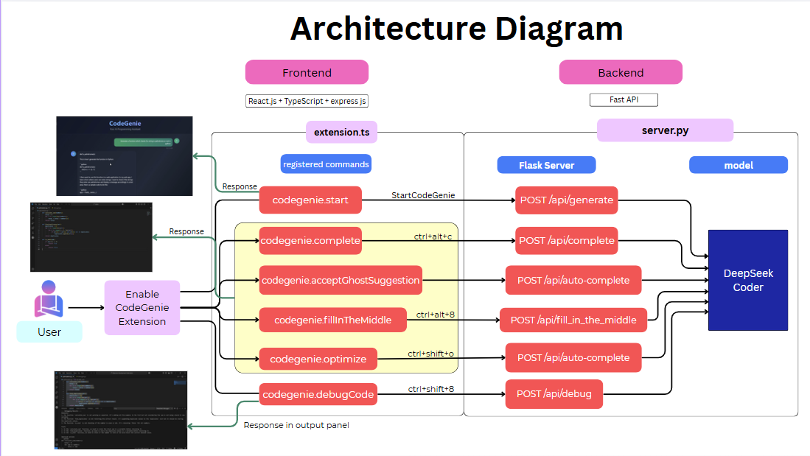
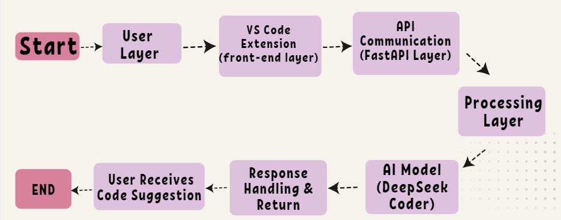

# CodeGenie-G335-PS25
Repo for CodeGenie PS project

# 🚀 CodeGenie – Your AI-Powered Coding Assistant  

## 📌 Introduction  
Welcome to **CodeGenie**, an intelligent **VS Code extension** that brings the power of AI-driven **code generation** right into your workflow! Powered by **DeepSeek Coder** and accelerated by an **RTX 4090 GPU**, this extension provides **real-time** code suggestions, **autocompletions**, and **context-aware snippets**, making development faster, smarter, and more efficient.  

---

# 🎯 Purpose of the Project  

- 🧠 **AI-Powered Code Assistance** – Integrate a cutting-edge **large language model (LLM)** to generate **intelligent** and **contextually relevant** code snippets.  
- 🔌 **Seamless VS Code Integration** – Develop a fully functional **VS Code extension** that enhances coding productivity.  
- ⚡ **Optimized Performance with GPU Acceleration** – Utilize a **high-performance RTX 4090 GPU** to ensure **fast** and **efficient** AI inference.  
- 🚀 **Enhancing Developer Experience** – Automate repetitive tasks, reduce errors, and speed up the coding process with AI-driven suggestions.  

---

# 🌍 Applications of the Project  

✅ **Real-Time Code Autocompletion** – Get instant code suggestions while typing, reducing keystrokes and enhancing efficiency.  
✅ **AI-Generated Code Snippets** – Automatically generate boilerplate code and reusable functions based on **contextual prompts**.  
✅ **Multi-Language Support** – Assist developers across various programming languages, improving cross-language compatibility.  
✅ **Error Detection & Fix Suggestions** – Help identify common coding mistakes and offer AI-powered solutions.  
✅ **Increased Productivity** – Reduce development time, improve code quality, and streamline workflows with **AI automation**.  

---

## Architecture Diagram

## WorkFlow

## 📖 Brief Explanation of the Reference Research Papers  

### 🔬 DeepSeek-Coder: Open-Source Large Language Models for Code Intelligence  

**DeepSeek-Coder** is a series of open-source **large language models (LLMs)** designed for **code understanding, generation, and completion**. These models, ranging from **1.3B to 33B parameters**, are pre-trained on a **high-quality, project-level code corpus** and employ advanced learning strategies to achieve **state-of-the-art performance** in open-source code intelligence.  

### 🏆 Key Contributions and Features  

- **Scalable Model Variants** – Supports models in sizes of **1.3B, 6.7B, and 33B parameters**, catering to various computational and application needs.  
- **Extensive Pretraining** – Trained on **2 trillion tokens** from **87 programming languages**, ensuring robust cross-language code comprehension.  
- **Repository-Level Data Organization** – Unlike conventional file-based training, DeepSeek-Coder incorporates **repository-level data structuring**, significantly enhancing cross-file code generation.  
- **Advanced Code Completion & Infilling** – Implements a **fill-in-the-middle (FIM) task** with a **16K context window**, improving in-line completions and cross-file dependency resolution.  
- **Superior Open-Source Performance** – Outperforms other open-source models (e.g., **CodeLlama, StarCoder, CodeGeeX2**) and even surpasses **GPT-3.5-Turbo** in multiple code-related benchmarks.  
- **Instruction-Tuned Model** – **DeepSeek-Coder-Instruct** further fine-tuned with **high-quality instructional data**, improving performance in multi-turn coding tasks and real-world programming challenges.  
- **Long-Context Adaptation** – Utilizes an **optimized RoPE-based positional encoding**, enabling effective processing of up to **16K tokens**, with the potential to scale beyond **64K tokens**.  
- **Cross-File Code Completion** – Evaluated on the **CrossCodeEval** benchmark, demonstrating superior performance in handling multi-file codebases.  
- **Mathematical & Reasoning Capabilities** – Fine-tuned versions (**DeepSeek-Coder-v1.5**) incorporate additional pretraining for **mathematical reasoning** and **natural language understanding** tasks.  

### 📊 Performance Benchmarks  

- **HumanEval & MBPP** – Achieves **66.0% accuracy**, outperforming **CodeLlama-33B**.  
- **LeetCode Contest Benchmark** – Surpasses **GPT-3.5-Turbo** and is the first open-source model to outperform it.  
- **DS-1000 (Data Science Benchmark)** – Excels in applying libraries like **NumPy, Pandas, and PyTorch** to real-world data science problems.  
- **CrossCodeEval** – Demonstrates **state-of-the-art performance** in **cross-file code understanding**, a key factor for repository-level code comprehension.  

### 📜 License & Availability  

DeepSeek-Coder is released under a **permissive open-source license**, allowing unrestricted use for research and commercial applications.  

🔗 **GitHub Repository:** [DeepSeek-Coder](https://github.com)  

---

🔥 Get ready to build the future of **AI-powered development** with **CodeGenie**! 🚀  
